+++
date = '2025-06-30T20:50:48+08:00'
draft = false
title = 'Hugo+Stack搭建个人博客'
tags = ['hugo', 'stack', 'blog']

+++

> 官网链接：
> 
> [hugo](https://gohugo.io/)
>
> [hugo-theme-stack](https://github.com/CaiJimmy/hugo-theme-stack)

## 准备工作

### 安装git

[git-scm:安装git](https://git-scm.com/)

### 安装hugo

[hugo安装指引](https://gohugo.io/installation/)，选择本地操作系统，决定要安装的版本(stack主题要求extended版本)，选择安装方式；

比如：windows系统-extended版本-二进制文件安装；

1. 访问[github-hugo发布页](https://github.com/gohugoio/hugo/releases/latest)，当前2025-6-28最新版本为0.147.9；
2. 下载[hugo_extended_0.147.9_windows-amd64.zip](https://github.com/gohugoio/hugo/releases/download/v0.147.9/hugo_extended_0.147.9_windows-amd64.zip);
3. 解压到本地目录，并添加环境变量指向该目录以便后续使用；

命令行输入`hugo version`指令，查看版本信息，验证是否安装成功；

```bash
hugo version
```

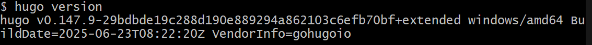

## 创建项目目录

`hugo new site [project-name]` 指令会在当前目录创建一个对应项目名称的项目文件夹，且该文件夹已包含站点所需的目录结构，各目录作用可参考[hugo目录结构说明](https://gohugo.io/getting-started/directory-structure/)；

```bash
# 在当前目录新建blog-test目录用作项目目录
hugo new site blog-test

# 进行项目目录，之后hugo指令将在该目录下执行
cd blog-test
```

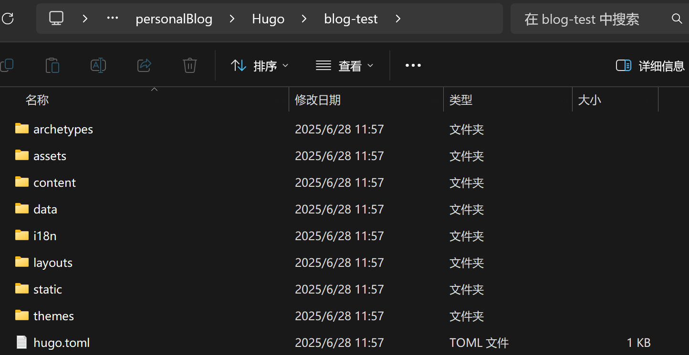

## 安装主题

完成以上操作，通过`hugo server`启动本地服务，使用浏览器访问`localhost:1313/`，会展示`404`页面，一方面站点还没有添加任何文章，另一方面没有安装主题；

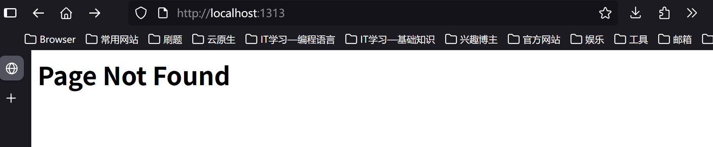

hugo项目没有默认主题，且没有添加文章就展示的机制，用户需安装主题并进行配置，站点才会应用主题。可访问[hugo主题站](https://themes.gohugo.io/)选择心仪主题，需注意不同主题在配置时存在差异，使用时应参考对应主题的说明文档；

本文将采用[Stack主题](https://github.com/CaiJimmy/hugo-theme-stack)，可通过[演示网站](https://demo.stack.jimmycai.com/)来预览主题效果；

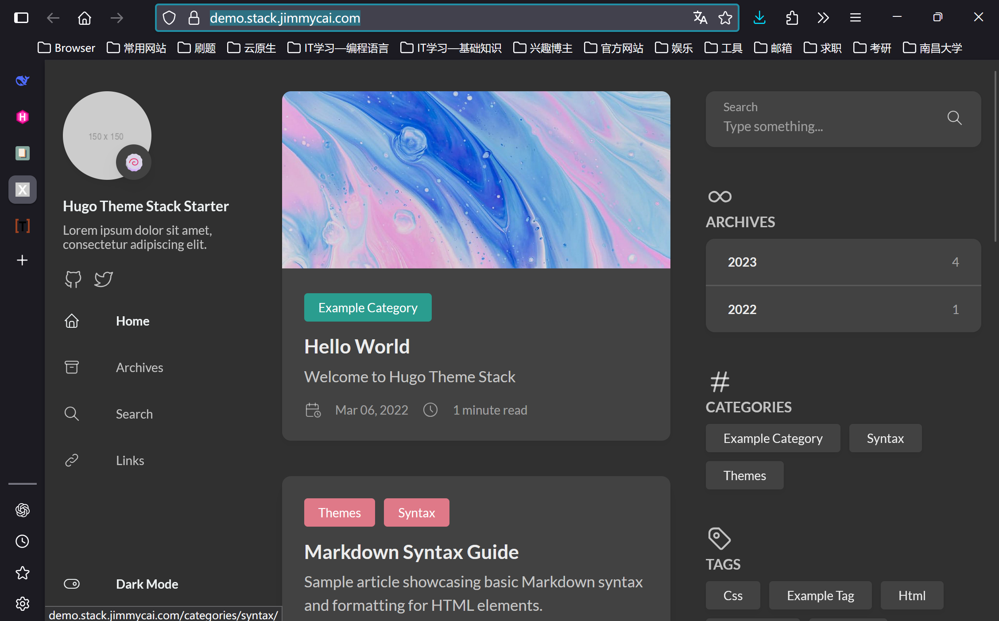

安装主题的本质是将对应的主题项目拷贝到当前项目的`themes`目录中，可以通过git安装，也可以直接下载，选择其中一种方式即可；

**通过git安装stack主题**

- 如果当前项目还没有通过`git init`进行初始化，可在项目的根目录执行`git clone`指令将主题拷贝到`themes`文件夹中；

```bash
git clone https://github.com/CaiJimmy/hugo-theme-stack/ themes/hugo-theme-stack
```

- 如果已使用git对项目进行版本控制，可通过`git submodule add` 来安装主题到`themes`；

```bash
git submodule add https://github.com/CaiJimmy/hugo-theme-stack/ themes/hugo-theme-stack
```

**手动下载stack主题**

前往[stack主题的github发布页](https://github.com/CaiJimmy/hugo-theme-stack/releases)下载最新版本的压缩包，解压到当前项目的`themes`中，注意将stack主题的根目录命名为`hugo-theme-stack`；

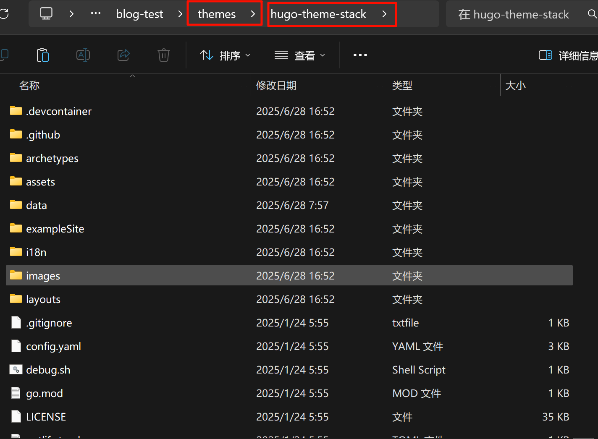

## 修改配置

==安装==主题后，hugo仍不会自动应用该主题，需通过配置指定该主题；站点配置文件为根目录中的`hugo.toml`，使用[toml](https://toml.io)语法(<mark>虽然toml区分大小写，但hugo为了提高容错率会将配置项转化为小写，导致在hugo使用toml时对大小写不严格</mark>)；

`hugo.toml`初始配置内容如下：

```toml
baseURL = 'https://example.org/'
languageCode = 'en-us'
title = 'My New Hugo Site'
```

- `baseURL`：指向网站的绝对根路径，主要是为了保证资源的正确加载；
  - 理论上在本地调试时应设置为`http://localhost:1313/`，实际上本地使用时不设置也可以；
  - 为避免不必要的错误，在生产环境时应设置正确的URL;
- `languageCode`：声明网站所用语言；
- `title`：网站标题；
- `theme`：设置站点所用主题，值为所用主题在`themes`目录下的目录名；

**示例**：后续将在github page上部署该网站，GitHub用户名为z-c，即项目部署网址为`https://z-c.github.io/`，网站主语言为中文，网站标题为`z-c的博客`，使用`stack`主题，`hugo.toml`应修改为以下内容:

```toml
baseURL = 'https://z-c.github.io/'
languageCode = 'zh-cn'
title = 'z-c的博客'
theme = 'hugo-theme-stack'
```

虽然还没有实际添加文章，因为已经安装且配置了`stack`主题，命令行执行`hugo server`后，浏览器访问`localhost:1313/`已经可以看到`stack`主题的默认效果；

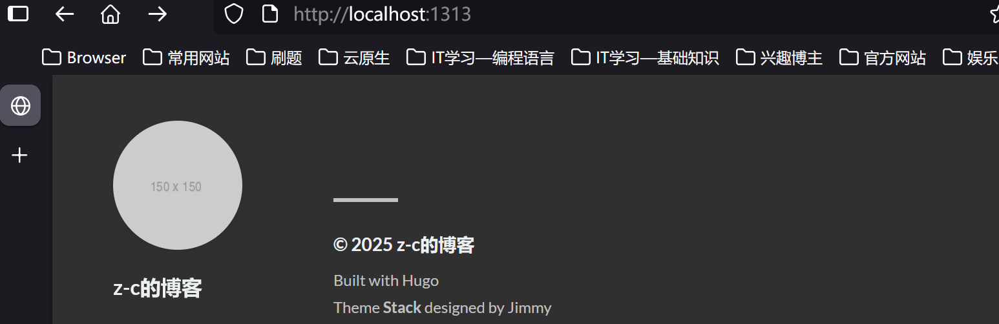

## 添加文章

<mark>注意</mark>：实际文章的添加方式与主题的默认配置有关；

`hugo new content [path]`指令可在指定目录添加文章，如果按照hugo官方文档提供的以下指令新增文章：

```bash
hugo new content content/posts/my-first-post.md
```

```bash
# 启用hugo服务，因为hugo new content默认新建的文章标识为draft，默认情况下不会一同部署，需另外添加-D参数
hugo server -D
```

实际执行效果：虽有在`content/posts`中成功生成含有默认front matter的`my-first-post.md`的文档，但浏览器访问`localhost:1313`时主页却没有展示刚添加的文章；


此时须访问`localhost:1313/posts`才显示刚添加的文章：

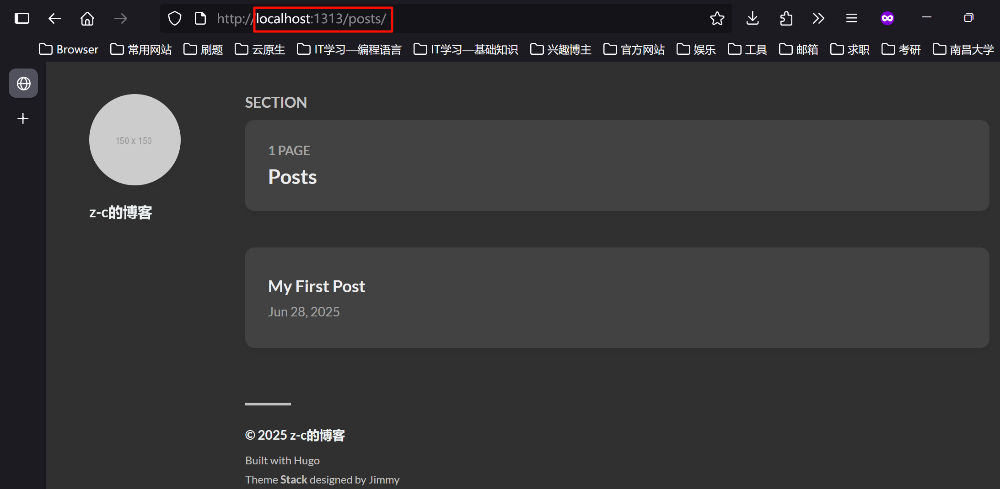

**原因分析**：`stack`主题将主内容章节(mainSections)配置项设置为了`content/post`，导致新增到`content/posts/`的文章并没有在主页展示；

```yaml
# themes/hugo-theme-stack/config.yaml
...
params:
    mainSections:
        - post
...
```

如果不修改配置，正确的作法是在`content/post`目录新增文章；

```bash
hugo new content content/post/my-first-blog.md

hugo server -D
```

浏览器访问`localhost:1313`有展示新添加到`content/post`中的文档；

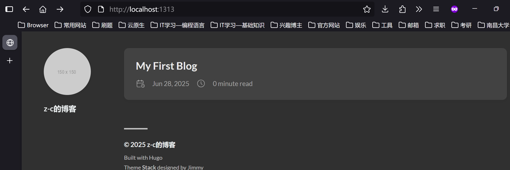

## front matter

如果手动在`content/post`中创建一份markdown文档，会发现并没有在网站展示出来，而`hugo new content`新建的markdown文档则可以，关键在于添加的文档是否含有`front matter`；

通过`hugo new content`新建的markdown文档，会在文档开头添加`front matter`，比如前面添加的`my-first-blog.md`;

```markdown
+++
date = '2025-06-28T19:21:02+08:00'
draft = true
title = 'My First Blog'
+++
```

hugo通过文档开头的`front matter`将其识别为要添加到网站的文档(后续实现本地文档自动添加到hugo项目的关键就包括`front matter`的添加)，另外`front matter`包含了文章层面的配置信息；

使用`+++...+++`包裹的`front matter`使用的是toml语法，`hugo new content`创建的文档，其`front matter`模板位于项目根目录`archetypes/default.md`；

```markdown
+++
date = '{{ .Date }}'
draft = true
title = '{{ replace .File.ContentBaseName "-" " " | title }}'

+++
```

- `date`：日期时间，取值为创建文档时的当前日期时间；
- `draft`：是否为Draft(草稿)，`hugo server`不添加draft标识的文档；
- `title`：标题，会将输入命令行的文件名中的`-`替换为空格作为标题；

`front matter`是对文章进行配置，还有其它配置项，这些配置项可能由hugo或主题提供；

## 进阶用法

知晓以上内容，已经可以部署出一个简单的博客网站了，但对比[stack主题演示页](https://demo.stack.jimmycai.com/)，会发现stack主题很多功能没用上，比如左侧边栏和右工具栏；此外文章一旦增加，有些操作会暴露新的问题，比如图片引用异常；

### 以目录的形式添加文章

上文有提到因为`stack`主题有对`mainSections`进行默认配置，新增文章应添加到`content/post`目录，才能在主页展示。比如通过`hugo new content content/post/xxx.md`指令在post目录中添加了文件名为`xxx`的markdown文档。这种作法存在弊端，文章数量一旦增加，且每个markdown文档都有引用本地图片时，图片的存放位置以及引用路径就会比较混乱，不方便管理；

为解决该问题，推荐的作法是：将文章与该文章所引用的资源放入同一个目录。具体作法如下：

1. 添加文章时在创建一个对应文章名的文件夹的基础上，添加文档文件`index.md`；

   ```bash
   hugo new content content/post/[article-name]/index.md
   ```

2. 将文章要引用的图片也添加到该目录(可创建子目录，比如`img`目录存放图片)；

   ```bash
   # 将所要引用的图片拷贝到文章目录的img文件夹中
   cp path/to/the/picture content/post/[article-name]/img
   ```

3. 在markdown文本中，通过相对路径进行引用对应图片；

   ```markdown
   
   ```

**示例**：新增`my-second-blog.md`，且该文章引用了两张图片`1.png`和`2.png`；

1. 以`my-second-blog/index.md`的形式添加文档；

   ```bash
   hugo new content content/post/my-second-blog/index.md
   ```

2. 在`my-second-blog`目录中新建`img`用于存放文章所要引用的图片；

   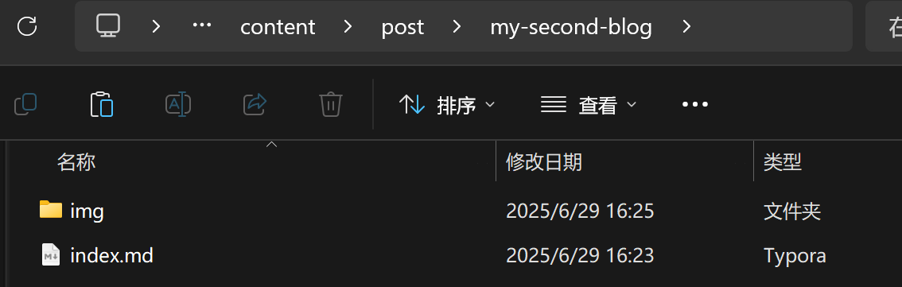

3. 文章中通过相对路径来引用`img`中的图片；

   ```markdown
   +++
   date = '2025-06-29T16:23:20+08:00'
   draft = true
   title = 'My Second Blog'
   
   +++
   
    
   ```

4. 启动hugo服务查看效果；

   ```bash
   hugo server -D
   ```

   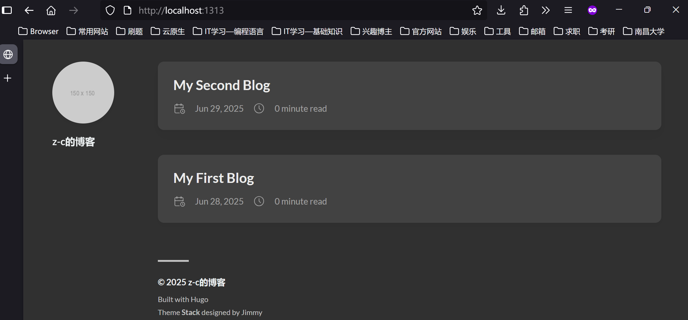

   通过相对路径引用的两张图片有正常展示，且以`stack`主题的画廊效果展示；

   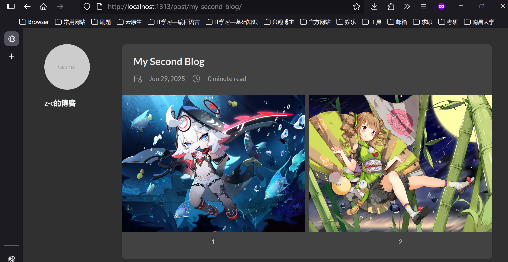

### stack主题其它自带功能

通过访问[stack主题演示](https://demo.stack.jimmycai.com/)，会发现stack主题自带了其它功能，既然是自带的，那么其底层就已经实现好了，我们要做的其实只是把这些功能调用出现，并正确展示；


#### 左侧边栏

实现左侧边栏的关键有两点：

1. 按照hugo规范新增对应目录；

   因为hugo默认会按照目录结构生成对应的URL：

   | 文件在项目中的路径          | 访问该页面的URL                   |
   | :-------------------------- | :-------------------------------- |
   | content/post/test1.md       | http://localhost:1313/post/test1/ |
   | content/post/test2/index.md | http://localhost:1313/post/test2/ |

   逆向思维：用户点击了左侧边栏的`Archives`选项卡，那么浏览器就会跳转归档页面，而归档页面的URL是否意味着项目的某目录存放归档页面的文件呢？所以我们要作的其实是在合适目录存放点击左侧边栏选项后响应页面的文件；

2. 按照stack主题规范配置侧边栏；

   实际上左侧边栏那些选项卡的设计，是调用[stack主题的菜单功能](https://stack.jimmycai.com/config/menu)，重点是配置`[menu.main]`，有两种配置方式：

   - 方式1：在根目录的`hugo.toml`中配置，这种方式有一个明显的不足：系统无法判断页面与选项卡之间联系，比如我点击`归档`选项跳转到归档页后，此时侧边栏的`归档`选项应该是选中状态，但因为是全局配置系统无法判断；
   - 方式2(推荐)：在对应响应页的`front matter`中进行配置，这样侧边栏选项卡设置虽然分布到了不同文件中，但仍然有效，且系统能识别当前页与选项卡的关系；

**示例1**：在左侧边栏添加`归档`选项卡，用户点击`归档`后，跳转到`http://localhost:1313/page/archives/`，页面展示stack主题提供的归档样式；

1. 在`content`目录中创建`page/archives/index.md`；

   ```bash
   hugo new content content/page/archives/index.md
   ```

2. 配置`content/page/archives/index.md`的`front matter`，以实现在左侧栏添加`归档`选项卡，且响应内容为stack主题提供的`themes/hugo-theme-stack/layout/_default/archives.html`样式；

   ```markdown
   +++
   title = '归档'
   layout = 'archives'
   slug = 'archives'
   
   [menu.main]
   name = '归档'
   weight = 2
   [menu.main.params]
   icon = 'archives'
   
   +++
   ```

   - `title`：页面标题；
   - `layout`：调用主题提供的布局；
   - `slug`：将原本通过项目目录映射来的URL的最后一段进行调整，如果存在`url`配置项，`url`配置项的优先级最高直接完全指定访问该页面的url；
   - `menu.main`：左侧边栏菜单配置；
     - `name`：选项卡名称；
     - `weight`：选项卡权重，用于调整多个选项卡的位置，权重小的越往上；
     - `params.icon`：选项卡图标，主题自带图标位于`themes/hugo-theme-stack/assets/icons`中；

3. 实际效果查看；

   ```bash
   hugo server -D
   ```

   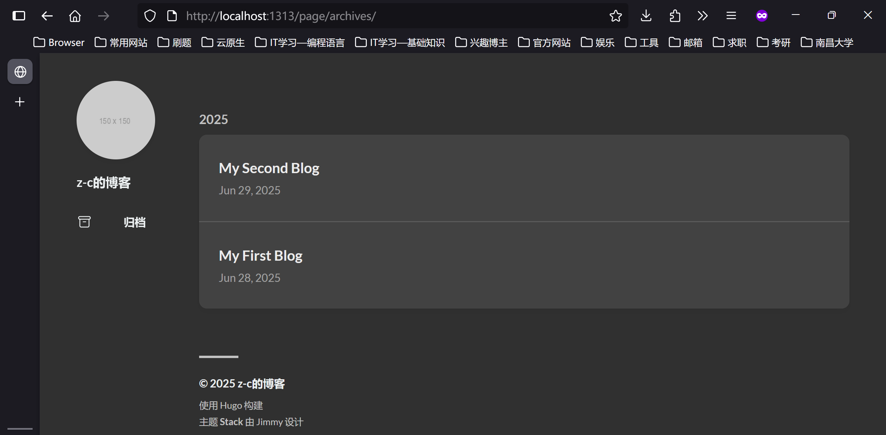

**示例2**：添加主页选项卡，因为主页即为网站首页，直接在`content`根目录，新建`_index.md`，内容如下：

```markdown
+++
[menu.main]
name = '主页'
weight = 1
[menu.main.params]
icon = 'home'

+++
```

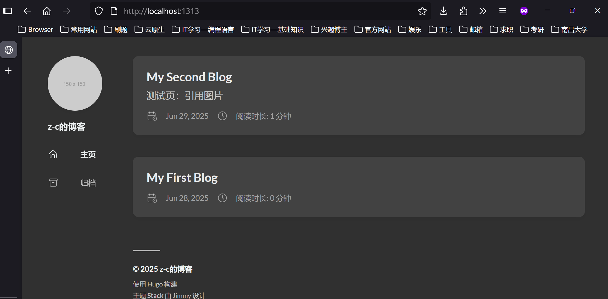

#### 右工具栏

较左侧边栏的选项卡，右工具栏在配置上简单很多，且主要是在项目根目录的`hugo.toml`直接对[stack主题小部件配置](https://stack.jimmycai.com/config/widgets)；

`widgets.homepage`：主页右边小部件配置；

`widgets.page`：文章页面右边小部件配置；

取值都是map数组，map有两个key：`type`和`params`，`type`指定部件名称，`params`某些部件的额外配置；

| 部件类型 | type       | 功能                                                         | params                             |
| -------- | ---------- | ------------------------------------------------------------ | ---------------------------------- |
| 归档     | archives   | 默认按时间归档                                               | limit = 10，默认展示10年的归档     |
| 搜索     | serach     | 搜索功能，需提前创建`layout = 'search'`的搜索页              |                                    |
| 目录     | categories | 目录                                                         | limit = 10，默认展示10个目录(模块) |
| 内容导航 | toc        | 文章页的内容导航，<br/>启用后，page内的front matter中toc = true才有效，toc = false该功能在本文章内关闭 |                                    |
| 标签     | tag-cloud  | 标签                                                         | limit = 10，默认展示10给标签       |

因为`wedgits`配置项直接在`hugo.toml`中进行，右侧工具栏各部件的前后顺序，直接由书写顺序决定；

<mark>为了将hugo本身配置与主题配置区分，主题提供的配置通常作为`params`的部分，通过`hugo.toml`书写stack主题配置时须在`params`下进行；</mark>

**示例**1：在主页依次添加`search`和`tag-cloud`部件;

1. 添加`hugo.toml`配置：往主页添加`search`和`tag-cloud`右侧部件；

   ```toml
   # hugo.toml
   
   [params]
   [params.widgets]
   [[params.widgets.homepage]]
   type = 'search'
   [[params.widgets.homepage]]
   type = 'tag-cloud'
   limit = 5
   ```

2. 为了保证stack主题搜索功能有效，须创建`lagout = 'serach'`的页面；

   ```bash
   hugo new content content/page/search/index.md
   ```

   `search/index.md`内容如下：

   ```markdown
   +++
   title = '搜索'
   layout = 'search'
   slug = 'search'
   outputs = [ "html", "json" ]
   
   +++
   ```

3. 给文章设置`tag`的方式为在`front matter`中通过`tags`配置标签组，无需其它配置，因为hugo已对tag进行了默认设置；

   ```markdown
   tags = ['tag1', 'tag2']
   ```

4. 启用hugo服务查看效果；

   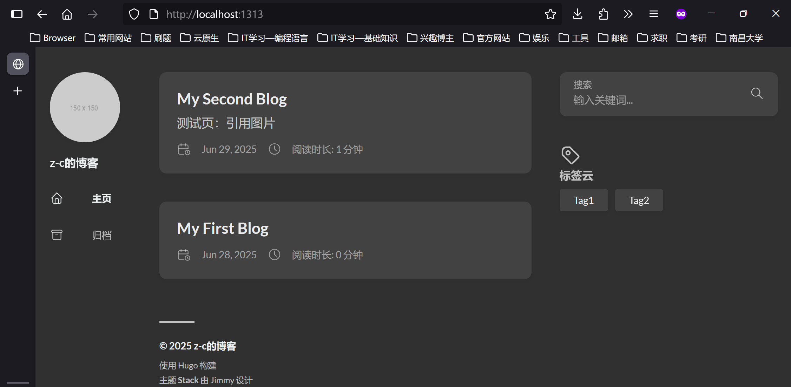

**示例**2：在文章页启用内容导航部件；

1. 添加`hugo.toml`配置：启用文章页的内容导航部件；

   ```toml
   [[params.widgets.page]]
   type = 'toc'
   ```

2. 在文章的`front matter`添加配置`toc = true`，不显式添加也行，因为默认值就为`true`；

3. 关于文章内导航有几点补充说明；

   - `front matter`中`toc = true`生效的前提是`hugo.toml`有启用内容导航部件，即单独在`front matter`中配置`toc = true`无效；
   - 当在`huto.toml`启用`toc`后，如果在`front matter`中`toc = false`，该文章的内容导航将关闭；
   - 文章是否启用内容导航需自行决定，因为就目前效果来看，stack主题内容页：左侧边栏，文章主体，右工具栏，这种布局导致内容部分很窄；

4. 启用hugo服务查看效果；

   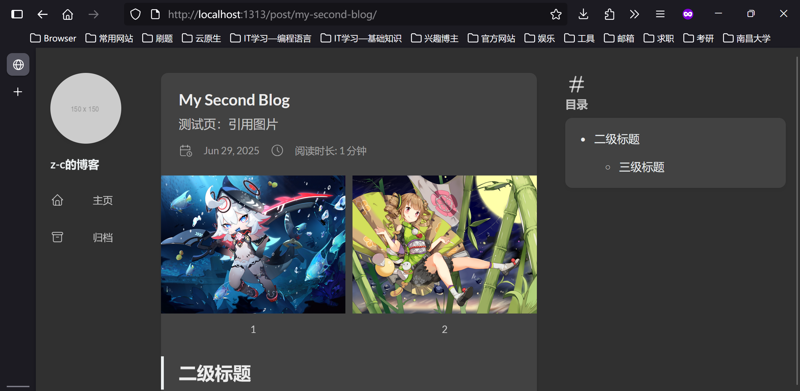

### _index.md与index.md

hugo中`index.md`和`_index.md`存在不同行为：

- `index.md`：访问该文档所在目录映射的URL时，页面会展示文档内容；
- `_index.md`：访问该文档所在目录映射的URL时，文档内容不被展示，默认调用`list.html`以列表形式展示子目录内容；

为提高使用的规范性，最好遵循以下使用规则：

- 对于文章内容页，或独立功能页，应使用`index.md`；
- 对于配置目录行为(排序，分页)，或展示子目录，应使用`_index.md`；

**示例**1：搜索页，搜索页作为独立功能页，应使用`index.md`，其中页面内容调用主题提供的`search`模板;

<mark>注意</mark>：stack主题search模板的位置为`themes/hugo-theme-stack/layout/page/search.html`，发现搜索页必须放置在`content/page/search`目录才能通过`layout = 'search'`使用搜索模板；

```bash
hugo new content content/page/search/index.md
```

`search/index.md`的内容如下:

```markdown
+++
title = '搜索'
layout = 'search'
slug = 'search'
outputs = [ "html", "json" ]

[menu.main]
name = '搜索'
weight = 3
[menu.main.params]
icon = 'search'
+++
```

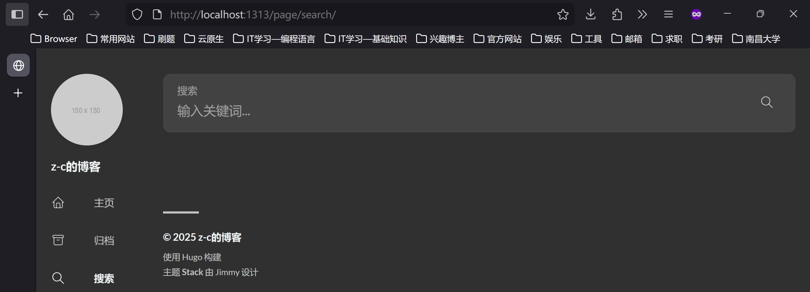

**示例**2：标签页，因为标签页主要是展示标签列表，应使用`_index.md`，或者不进行任何创建，因为hugo默认支持该行为行为(小不足就是标题`tags`没进行国际化)；

比如点击一个`tag1`的标签后，会跳转到的url`tags/tag1/`的页面，可以在`content/tags/`目录创建`_index.md`；

```bash
hugo new contetn content/tags/_index.md
```

`tags/_index.md`内容如下：

```markdown
+++
title =  "标签"
slug =  "tags"
+++
```

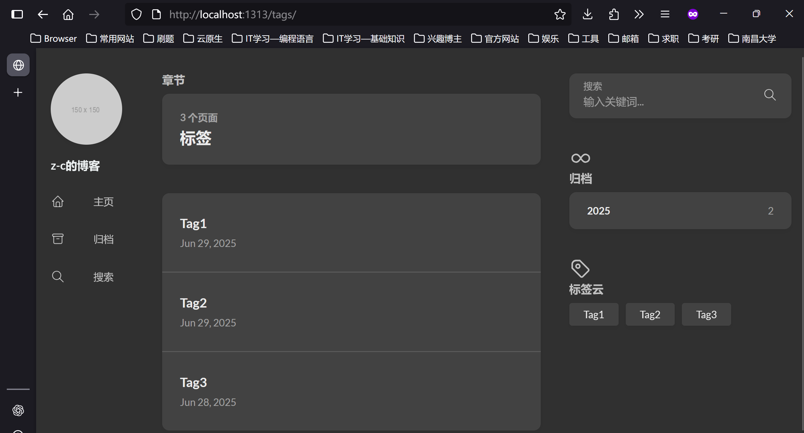

### 优化URL

hugo默认使用基于项目目录的URL生成规则，不合理的项目结构会导致URL冗余，为进一步优化URL，可配置`permalinks`；

`permalinks`的取值为键值对集合，键名为要转化的目录名，值为要转化成的url片段，具体作用就是将目录中的所有文档的url中目录片段进行替换；

```toml
[permalinks]
目录名 = '自定义url片段'
```

url片段通常包含占位符，常见占位符：

- `:slug`——对应`front matter`中设定的`slug`值或文件名；
- `:filename`——表示文件名(不包含拓展名)；

**示例**：将`content/page/serach/index.md`的url修改为`local host:1313/search/`；

```toml
# hugo.toml
[permalinks]
page = '/:slug/'
```

|             目录             |              默认URL               |           优化后URL           |
| :--------------------------: | :--------------------------------: | :---------------------------: |
| content/page/search/index.md | http://localhost:1313/page/search/ | http://localhost:1313/search/ |

### 评论系统

虽然[hugo-评论功能说明](https://gohugo.io/content-management/comments/#article)有简单介绍评论功能，但为充分利用stack主题，将参考[stack主题：评论功能说明](https://stack.jimmycai.com/config/comments)来配置评论系统；

以[utterances](https://utteranc.es/)为例：

1. 配置`hugo.toml`启用评论功能，并指定`utterances`作为评论系统；

   ```toml
   [params.comments]
   enabled = true
   provider = 'utterances'
   ```

   - `enabled`：默认值为false，设置为true以启用评论功能；
   - `provides`：所用的评论系统，这里使用`utterances`;

2. 配置utterances：

   1. 创建并登录GitHub账号，新建用于评论的仓库(要求为public)；

   2. 给该仓库安装[utterances app](https://github.com/apps/utterances)；

   3. 在`hugo.toml`中添加关于utterances的配置项；

      ```toml
      [params.comments.utterances]
      repo = "[author/github-repository]"
      issue-term = "url"
      label = "comment"
      ```

      - `repo`：指向那个安装了utterance app的public仓库，值为`用户名/仓库名`；
      - `issue-term`：issue标题，可选值有`pathname`(基于页面路径)，`url`(基于完整 URL)，`title`(基于页面标题)；
      - `label`：标签；

  3. 补充说明：

     - 通过[utterance指引](https://utteranc.es/)填写对应信息后会给出对应的js配置，可将需要的片段修改格式后添加到`hugo.toml`中;
     - 当前stack主题只支持以上三个配置项，其它配置不支持，需另外实现；
     - 关于匿名评论，因为utterances是基于github issue，需要登录GitHub账号后评论；

## 打包部署

### 打包

`hugo`或者`hugo build`可将项目进行打包，会将作为静态文件服务的相关文件打包在根目录的`public`中。

- 实际上执行`hugo server` 时，默认先执行了打包，所以执行`hugo server`后`public`也发生了变化；

- hugo中的打包操作默认以覆盖的形式进行，比如修改了某篇文章，`public`中保留修改后的文章，但对于删除了某篇文章，`public`中其实还保留着。<mark>如有必要，打包项目前可将`public`进行清空操作</mark>；

- 同`hugo server -D`添加`-D`的作用是将标识为`draft`的文章一同打包，相关参数如下：

  | 参数                   | 对应的文章                                      |
  | ---------------------- | ----------------------------------------------- |
  | -D<br/>----buildDrafts | 草稿，draft为true的文章                         |
  | -E<br/>--buildExpired  | 过期，expiryDate为过去时间的文章                |
  | -F<br/>--buildFuture   | 未发布，date或者publishDate时间是将来时间的文章 |

### 部署

取决于当前拥有的条件，部署方式有很多：

1. 可直接将`public`目录拷贝到云主机的目标目录中，然后借助`nginx`来部署；
2. hugo有`extended/deploy`版本，可直接本地命令行部署到配置好的服务器；
3. 将`public`中打包好的项目上传到提供静态文件服务的平台，比如GitHub page，cloudflare page;

### Github Page托管项目

GitHub有工作流机制，可直接托管项目，打包和部署操作由GitHub Action完成，操作流程可参考[hugo-托管到GitHub Page](https://gohugo.io/host-and-deploy/host-on-github-pages/);
